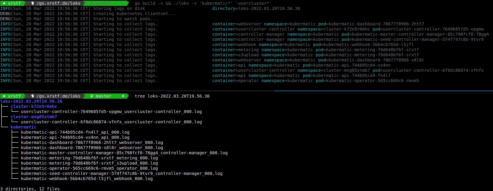

# loks - Collect Kubernetes Pod Logs with Ease

`loks` is a command line tool to watch for pods and storing their logs as text files
on your local machine. It's primarily intended to be used in test scenarios where you
need to gather logs of many different, possibly restarting or reconciled pods at the
same time.

<p align="center">
  
</p>

## Installation

You can download a binary for the [latest release on GitHub](https://github.com/xrstf/loks/releases)
or install loks via Go:

```bash
go install go.xrstf.de/loks
```

## Usage

```
Usage of loks:
  -c, --container stringArray   Container names to store logs for (supports glob expression) (can be given multiple times)
  -f, --flat                    Do not create directory per namespace, but put all logs in the same directory
      --kubeconfig string       kubeconfig file to use (uses $KUBECONFIG by default)
  -l, --labels string           Label-selector as an alternative to specifying resource names
      --live                    Only consider running pods, ignore completed/failed pods
  -n, --namespace stringArray   Kubernetes namespace to watch resources in (supports glob expression) (can be given multiple times)
      --oneshot                 Dump logs, but do not tail the containers (i.e. exit after downloading the current state)
  -o, --output string           Directory where logs should be stored
  -v, --verbose                 Enable more verbose output
```

## Examples

```bash
loks '*'
```

This is the BFG: it will watch all Pods in all namespaces and stream the logs for each running container to
a text file in your disk. Don't do this, you do not want to kill the apiserver with a gazillion streams.

```bash
loks -n kube-system -n 'cluster-*'
```

You can restrict the Pods to a set of namespaces. Wildcards are allowed.

```bash
loks -l 'foo=bar'
```

Label selectors work just as you would expect.

```bash
loks 'kube-*' 'coredns-*' 'etcd-*'
```

You can give multiple name patterns, placeholders are allowed.

```bash
loks -c 'test*' 'kube-*' 'coredns-*' 'etcd-*'
```

You can restrict the container names using `-c`. This flag can be given multiple times and also supports wildcards.

```bash
loks -o test 'kube-*' 'coredns-*' 'etcd-*'
```

By default loks will create a `loks-%Y%m%dT%m.%h%s` directory whenever you invoke it, but you can also specify
a directory yourself.

```bash
loks -o test -f 'kube-*' 'coredns-*' 'etcd-*'
```

By default loks will create one directory per namespace. With `-f` (`--flat`) you can disable this behaviour.

## License

MIT
